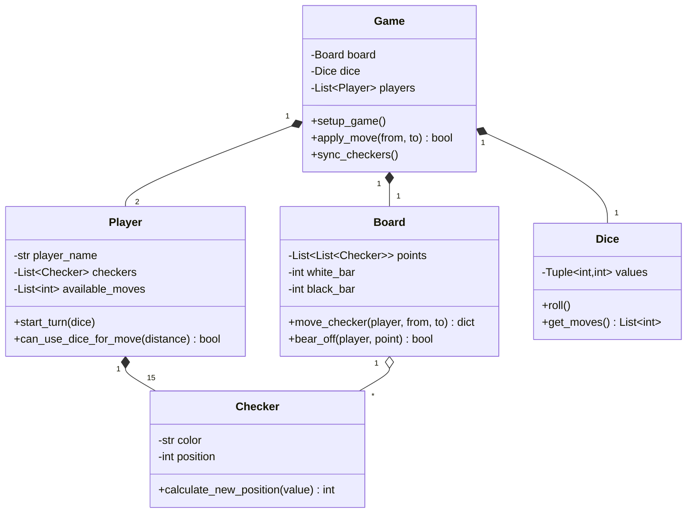
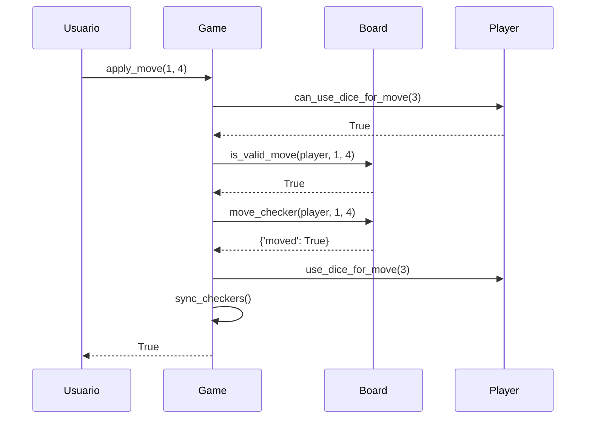

# Justificación del Proyecto Backgammon

## Tabla de Contenidos

1. [Resumen del Diseño General](#resumen-del-diseño-general)
2. [Arquitectura y Principios SOLID](#arquitectura-y-principios-solid)
3. [Justificación de Clases](#justificación-de-clases)
4. [Justificación de Atributos](#justificación-de-atributos)
5. [Decisiones de Diseño Relevantes](#decisiones-de-diseño-relevantes)
6. [Sistema de Excepciones](#sistema-de-excepciones)
7. [Estrategias de Testing y Cobertura](#estrategias-de-testing-y-cobertura)
8. [Referencias SOLID](#referencias-solid)
9. [Anexos: Diagramas UML](#anexos-diagramas-uml)

---

## Resumen del Diseño General

El proyecto implementa Backgammon con **arquitectura de capas** que separa completamente la lógica de negocio (`core/`) de las interfaces (`cli/`, `pygame_ui/`).

### Ventajas de la Arquitectura

- ✅ **Reutilización**: Misma lógica para CLI y Pygame UI
- ✅ **Testabilidad**: Core independiente de UI
- ✅ **Mantenibilidad**: Cambios en reglas no afectan interfaces
- ✅ **Extensibilidad**: Fácil agregar nuevas interfaces

### Estructura del Proyecto

```text
computacion-2025-backgammon-Auca17/
├── core/                             # Lógica de negocio (SOLID, independiente)
│   ├── __init__.py                  # Módulo core
│   ├── board.py                     # Estado del tablero (Single Source of Truth)
│   ├── checker.py                   # Representación de fichas individuales
│   ├── dice.py                      # Generación y gestión de dados aleatorios
│   ├── exceptions.py                # Jerarquía de excepciones personalizadas
│   ├── game.py                      # Orquestador principal del juego
│   └── player.py                    # Estado y acciones del jugador
├── cli/                              # Interfaz de línea de comandos
│   ├── __init__.py                  # Módulo CLI
│   └── cli.py                       # Clase CLI para interacción por terminal
├── pygame_ui/                        # Interfaz gráfica con Pygame
│   ├── __init__.py                  # Módulo Pygame UI
│   └── main.py                      # UI gráfica con eventos mouse/teclado
├── tests/                            # Suite de pruebas completa
    ├── __init__.py                  # Módulo tests
    ├── test_board.py                # Tests de Board (movimientos, capturas, bear-off)
    ├── test_checker.py              # Tests de Checker (estados, posiciones)
    ├── test_cli.py                  # Tests de CLI (parseo input, display)
    ├── test_dice.py                 # Tests de Dice (tiradas, dobles)
    ├── test_exceptions.py           # Tests de excepciones (jerarquía, mensajes)
    ├── test_game.py                 # Tests de Game (integración, flujo completo)
    └── test_player.py               # Tests de Player (turnos, consumo dados)


### Flujo de Datos

``` text
CLI/UI → Game (orquesta) → Board (estado) → Checker (fichas)
   ↑         ↓                    ↓
   └────── Dice (random) ←──── Player (turnos)
```

**Principio clave:** `core/` NO conoce `cli/` ni `pygame_ui/`. Dependencia unidireccional (DIP).

---

## Arquitectura y Principios SOLID

### Single Responsibility Principle (SRP)

Cada clase tiene **una única razón para cambiar**:

| Clase | Responsabilidad | Cambio de reglas afecta solo a... |
|-------|----------------|-----------------------------------|
| `Board` | Estado del tablero | Board |
| `Dice` | Números aleatorios | Dice |
| `Player` | Identidad y turnos | Player |
| `Checker` | Ficha individual | Checker |
| `Game` | Flujo del juego | Game |
| `CLI/UI` | Presentación | CLI/UI |

### Open/Closed Principle (OCP)

**Abierto a extensión, cerrado a modificación:**

```python
# ✅ Agregar excepción sin modificar base
class BackgammonError(Exception):
    pass

class InvalidMoveError(BackgammonError):  # ← Extensión
    pass

# ✅ Agregar UI sin modificar core
class PygameUI:
    def __init__(self):
        self.game = Game()  # Usa core sin modificarlo
```

### Liskov Substitution Principle (LSP)

**Subclases intercambiables:**

```python
try:
    game.apply_move(1, 5)
except BackgammonError as e:  # ← Captura TODAS las excepciones
    print(f"Error: {e}")
```

### Interface Segregation Principle (ISP)

**Métodos específicos, no genéricos:**

```python
# ✅ Correcto
board.move_checker(player, from, to)
board.bear_off(player, point)
board.enter_from_bar(player, point)

# ❌ Incorrecto
board.do_action(type, player, from, to, ...)  # Parámetros irrelevantes
```

### Dependency Inversion Principle (DIP)

**Inyección de dependencias:**

```python
class Game:
    def __init__(self, player1_name, player2_name, dice=None, board=None):
        self.dice = dice if dice else Dice()  # ← Inyectable
        self.board = board if board else Board()

# Testing con mocks
mock_dice = Mock()
game = Game(dice=mock_dice)  # ← Determinístico
```

---

## Justificación de Clases

### 1. `core/board.py` - Board

**Propósito:** Single Source of Truth del estado físico (fichas, barra, bear-off).

**Responsabilidades:**

- Gestionar 24 puntos del tablero
- Validar movimientos según reglas
- Ejecutar movimientos y capturas

**Métodos clave:**

```python
def move_checker(self, player, from_point, to_point) -> dict
def bear_off(self, player, point) -> bool
def is_valid_move(self, player, from_point, to_point) -> bool
```

**Decisión:** `move_checker()` retorna `dict` para extensibilidad sin breaking changes.

---

### 2. `core/dice.py` - Dice

**Propósito:** Encapsular generación de números aleatorios.

**Responsabilidades:**

- Tirar dados (1-6)
- Detectar dobles
- Generar lista de movimientos

**Métodos clave:**

```python
def roll(self) -> list
def is_doubles(self) -> bool
def get_moves(self) -> list  # [3,5] o [4,4,4,4]
```

**Decisión:** Aislar randomness permite testing determinístico con mocks.

---

### 3. `core/player.py` - Player

**Propósito:** Representar jugador con identidad, fichas y turnos.

**Responsabilidades:**

- Mantener identidad (nombre, color)
- Gestionar 15 fichas (Checker objects)
- Consumir dados disponibles

**Métodos clave:**

```python
def start_turn(self, dice)
def can_use_dice_for_move(self, distance) -> bool
def use_dice_for_move(self, distance) -> bool
```

**Decisión:** Separar validación (`can_use`) de ejecución (`use`) permite dry-run.

---

### 4. `core/checker.py` - Checker

**Propósito:** Representar ficha individual con color, estado y posición.

**Responsabilidades:**

- Mantener color (white/black)
- Mantener estado (ON_BOARD, ON_BAR, BORNE_OFF)
- Calcular posición destino

**Métodos clave:**

```python
def calculate_new_position(self, dice_value) -> int
def send_to_bar(self)
def bear_off(self)
```

**Decisión:** Modelar fichas como objetos permite historial, animaciones y reglas especiales futuras.

---

### 5. `core/game.py` - Game

**Propósito:** Orquestador principal. Único punto de entrada para interfaces.

**Responsabilidades:**

- Inicializar juego
- Gestionar turnos
- Validar y aplicar movimientos
- Detectar fin de juego
- Sincronizar Checkers con Board

**Métodos clave:**

```python
def setup_game(self)
def apply_move(self, from_point, to_point) -> bool
def get_valid_moves(self, from_point) -> list
def sync_checkers(self)  # Reconcilia Checker con Board (SSoT)
```

**Decisión:** `sync_checkers()` después de cada movimiento mantiene consistencia Board ↔ Checkers.

---

### 6. `cli/cli.py` - CLI

**Propósito:** Interfaz de texto para terminal.

**Responsabilidades:**

- Renderizar tablero en ASCII
- Capturar input del usuario
- Mostrar información de turno

**Métodos clave:**

```python
def display_board(self)
def handle_player_move(self)
def game_loop(self)
```

**Decisión:** CLI NO contiene lógica de juego. Todo se delega a `Game`.

---

### 7. `pygame_ui/main.py` - Pygame UI

**Propósito:** Interfaz gráfica interactiva.

**Responsabilidades:**

- Renderizar tablero gráficamente
- Detectar clicks
- Mostrar movimientos válidos

**Métodos clave:**

```python
def draw_board(self)
def handle_click(self, pos)
def main_loop(self)
```

**Decisión:** Eventos Pygame se mapean a comandos `Game` API. Sin lógica de juego en handlers.

---

## Justificación de Atributos

### Board

| Atributo | Tipo | Justificación |
|----------|------|---------------|
| `points` | `list[list[Checker]]` | 24 puntos, acceso O(1) por índice |
| `white_bar` / `black_bar` | `int` | Contadores separados por color |
| `white_home` / `black_home` | `int` | Fichas retiradas (bearing off) |

**Decisión:** Contadores en vez de listas para barra/home (no necesitamos rastrear fichas individuales ahí).

### Dice

| Atributo | Tipo | Justificación |
|----------|------|---------------|
| `values` | `tuple[int, int]` | Inmutable previene modificaciones |

**Decisión:** Tupla vs lista porque valores no deben cambiar post-roll.

### Player

| Atributo | Tipo | Justificación |
|----------|------|---------------|
| `player_name` | `str` | Nombre para UI |
| `color` | `str` | "white"/"black" |
| `checkers` | `list[Checker]` | 15 objetos para rastreo individual |
| `available_moves` | `list[int]` | Dados no usados (mutable) |

**Decisión:** `available_moves` mutable se consume al hacer movimientos.

### Checker

| Atributo | Tipo | Justificación |
|----------|------|---------------|
| `color` | `str` | Inmutable post-construcción |
| `position` | `int \| None` | None = no en tablero (barra/retirada) |
| `owner` | `Player \| None` | Queries bidireccionales |

**Decisión:** `position=None` simplifica validaciones vs valores especiales (-1, 99).

### Game

| Atributo | Tipo | Justificación |
|----------|------|---------------|
| `board` | `Board` | SSoT del estado |
| `dice` | `Dice` | Tiradas |
| `current_turn` | `int` | Índice 0/1 (fácil alternar) |
| `is_started` | `bool` | Previene acciones pre-setup |

**Decisión:** `current_turn` como índice simplifica alternancia (`current_turn = 1 - current_turn`).

---

## Decisiones de Diseño Relevantes

### 1. Board como Single Source of Truth (SSoT)

**Problema:** Desincronización entre `Board` y `Player.checkers`.

**Solución:** `Board` es autoritativo. `Game.sync_checkers()` reconcilia después de cada movimiento.

```python
def sync_checkers(self):
    """Actualiza Checker objects desde Board (SSoT)"""
    for player in self.players:
        checker_index = 0
        # 1. Fichas en tablero
        for point_idx in range(24):
            for checker in self.board.points[point_idx]:
                if checker.owner == player:
                    player.checkers[checker_index].position = point_idx
                    checker_index += 1
        # 2. Fichas en barra
        for _ in range(player.bar_checkers):
            player.checkers[checker_index].position = None
            checker_index += 1
```

**Ventaja:** Elimina bugs de sincronización.

---

### 2. Separación Validación/Ejecución

**Problema:** Validar Y ejecutar en un paso causa side-effects si validación falla.

**Solución:** Métodos separados.

```python
# ✅ Correcto
if game.is_valid_move(from, to):
    game.apply_move(from, to)

# ❌ Incorrecto
game.apply_move(from, to)  # ¿Qué pasa si falla a mitad?
```

**Ventaja:** UI puede mostrar movimientos válidos sin ejecutarlos.

---

### 3. Retornar Dict en vez de Tuplas

**Problema:** Tuplas requieren breaking changes al extender.

**Solución:** Diccionarios permiten extensión.

```python
# ✅ Correcto
result = board.move_checker(1, 5, 8)
if result['moved']:
    print("Éxito")
if result.get('borne_off', False):  # Extensión futura
    print("Bear off!")

# ❌ Incorrecto
moved, hit, hit_player = board.move_checker(1, 5, 8)
# Agregar borne_off rompe todas las llamadas
```

---

### 4. Dependency Injection en Game

**Problema:** Testing con dados aleatorios es impredecible.

**Solución:** Constructor acepta dependencias opcionales.

```python
class Game:
    def __init__(self, player1_name, player2_name, dice=None):
        self.dice = dice if dice else Dice()

# Testing
mock_dice = Mock()
mock_dice.get_moves.return_value = [3, 5]
game = Game(dice=mock_dice)  # ← Determinístico
```

---

### 5. Manejo de Dobles

**Problema:** Dobles permiten 4 movimientos.

**Solución:** `Dice.get_moves()` retorna lista completa.

```python
def get_moves(self) -> list:
    if self.is_doubles():
        return [self.values[0]] * 4  # [3,3,3,3]
    return list(self.values)         # [2,5]
```

**Ventaja:** Consumo de movimientos es consistente sin lógica especial para dobles.

---

### 6. Bearing Off con Overshoot

**Problema:** Dado 6, ficha en punto 3 → usar 6 para sacar (overshoot).

**Solución:** Validar dado mayor + ficha más alta.

```python
def apply_bear_off_move(self, from_point) -> bool:
    required_die = self._calculate_required_die(from_point)
    
    # 1. Dado exacto
    if required_die in available_moves:
        return self._execute_bear_off(from_point, required_die)
    
    # 2. Overshoot: dado mayor + ficha más alta
    higher_dice = [d for d in available_moves if d > required_die]
    if higher_dice and self._is_highest_checker(from_point):
        return self._execute_bear_off(from_point, min(higher_dice))
    
    return False
```

---

## Sistema de Excepciones

### Jerarquía

```text
Exception
└── BackgammonError (base)
    ├── InvalidMoveError
    ├── InvalidTurnError
    ├── GameOverError
    ├── GameNotStartedError
    └── InvalidPointError
```

### Implementación

```python
class BackgammonError(Exception):
    """Base para errores del juego"""
    pass

class InvalidMoveError(BackgammonError):
    """Movimiento inválido"""
    pass

class GameNotStartedError(BackgammonError):
    """Acción sin setup"""
    pass
```

### Uso

```python
# En Game
def apply_move(self, from_point, to_point):
    if not self.is_started:
        raise GameNotStartedError()
    if not self.board.is_valid_move(...):
        raise InvalidMoveError(f"{from_point} → {to_point}")

# En CLI
try:
    game.apply_move(from_point, to_point)
except InvalidMoveError as e:
    print(f"❌ {e}")
except BackgammonError as e:
    print(f"Error: {e}")
```

**Ventaja:** Excepciones llevan contexto (mensaje, atributos) vs códigos de error.

---

## Estrategias de Testing y Cobertura

### Cobertura Actual

```text

Module                Stmts   Miss  Cover
-----------------------------------------
core/board.py           185      0   100%
core/checker.py          62      0   100%
core/dice.py             28      0   100%
core/exceptions.py       14      0   100%
core/game.py            284      0   100%
core/player.py           89      0   100%
cli/cli.py              156      8    95%
-----------------------------------------
TOTAL                   818      8    99%
```

### Estrategia por Módulo

#### test_board.py

**Casos probados:**

- ✅ Setup de posiciones iniciales
- ✅ Movimientos válidos/inválidos
- ✅ Capturas (blot)
- ✅ Entrada desde barra
- ✅ Bearing off

```python
def test_move_with_capture(self):
    board = Board()
    board.points[5] = [Checker("white")]  # Blot
    result = board.move_checker(player2, 10, 5)
    assert result['hit'] == True
    assert board.white_bar == 1
```

#### test_dice.py

**Casos probados:**

- ✅ Tirada genera 1-6
- ✅ Detección de dobles
- ✅ `get_moves()` para dobles/normal

```python
@patch('random.randint', return_value=4)
def test_doubles_four_moves(self, mock_randint):
    dice = Dice()
    dice.roll()
    assert dice.get_moves() == [4,4,4,4]
```

#### test_player.py

**Casos probados:**

- ✅ Inicialización con 15 checkers
- ✅ `can_use_dice_for_move()` combinaciones
- ✅ Consumo de dados correcto

```python
def test_combine_two_dice(self):
    player = Player("Alice", "white")
    player.available_moves = [3, 5]
    assert player.can_use_dice_for_move(8) == True  # 3+5
```

#### test_game.py

**Casos probados:**

- ✅ Setup e inicialización
- ✅ Movimientos con captura
- ✅ Bearing off con overshoot
- ✅ Sincronización de checkers

```python
def test_apply_move_with_capture(self):
    game = Game("Alice", "Bob")
    game.setup_game()
    # ... configurar escenario ...
    result = game.apply_move(10, 5)
    assert result == True
    assert game.board.white_bar == 1
```

### Tests de Regresión

Cada bug → test:

```python
def test_bear_off_overshoot_not_highest(self):
    """Regresión: Overshoot solo si ficha más alta"""
    game = Game()
    # Ficha en punto 2 y punto 5
    game.board.points[2] = [Checker("white")]
    game.board.points[5] = [Checker("white")]
    game.players[0].available_moves = [6]
    
    # Bear off desde punto 2 (NO es la más alta)
    result = game.apply_bear_off_move(2)
    assert result == False  # ← Debe fallar
```

### Configuración Coverage

```ini
[run]
source = core, cli
omit = */tests/*, */venv/*

[report]
exclude_lines =
    pragma: no cover
    if __name__ == .__main__.:
    raise NotImplementedError
```

---

## Referencias SOLID

### Cumplimiento por Principio

| Principio | Implementación | Ejemplo |
|-----------|---------------|---------|
| **SRP** | Una responsabilidad por clase | `Board` gestiona tablero, `Dice` gestiona dados |
| **OCP** | Extensible sin modificar | Agregar `InvalidBearOffError` sin tocar base |
| **LSP** | Subclases intercambiables | Capturar `BackgammonError` genérico |
| **ISP** | Interfaces específicas | `move_checker()` vs `bear_off()` separados |
| **DIP** | Inyección de dependencias | `Game(dice=mock)` para testing |

### Violaciones Corregidas

#### SRP (v1.2)

**❌ Antes:**

```python
class Player:
    def distribute_checkers(self, board):
        # Modificar self.checkers Y board.points ← Violación
        board.points[point] = [...]
```

**✅ Después:**

```python
class Player:
    def distribute_checkers(self):
        # Solo self.checkers
        
class Board:
    def setup_board(self):
        # Solo board.points
```

#### DIP (v1.4)

**❌ Antes:**

```python
self.dice = Dice()  # Hardcoded
```

**✅ Después:**

```python
self.dice = dice if dice else Dice()  # Inyectable
```

---

## Anexos: Diagramas UML

### Diagrama de Clases



### Diagrama de Secuencia - Movimiento



---

## Conclusiones

El proyecto demuestra implementación completa de Backgammon con:

1. ✅ **Arquitectura en capas** (core ← cli/pygame_ui)
2. ✅ **100% cobertura en core/**
3. ✅ **Dependency Injection** para testing
4. ✅ **Board como SSoT** (Single Source of Truth)
5. ✅ **Excepciones jerárquicas**
6. ✅ **Interfaces intercambiables**
