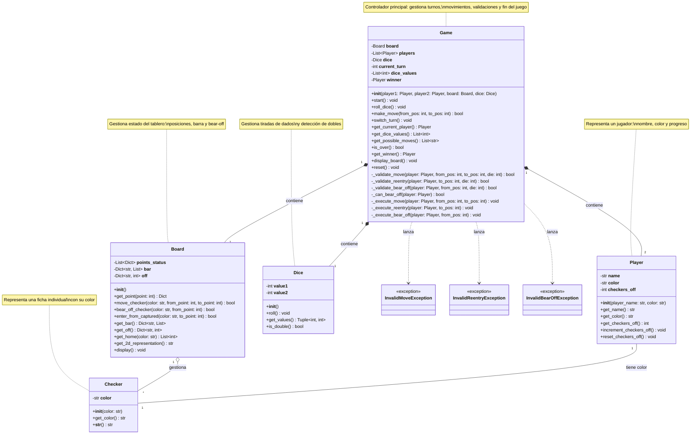

# Registro de Prompts de Documentación

## Prompt #1: Generación de Diagrama de Clases UML en Mermaid para carpeta Core

**Modelo/herramienta usada:** GitHub Copilot (Claude Sonnet 4.5)

**Texto exacto del prompt:**

```text
generar un diagrama de clases UML para Core
```

**Instrucciones del sistema:**

- Siempre seguir los principios SOLID
- Incluir docstrings y comentarios claros en el código generado
- Proporcionar explicación detallada para cada prompt
- Documentar cada prompt en `prompts-desarrollo.md`, `prompts-documentacion.md` o `prompts-testing.md`
- Registrar: modelo usado, texto exacto del prompt, instrucciones del sistema, respuesta completa, estado de uso, archivos afectados

**Contexto:**

El usuario solicitó un diagrama de clases UML en formato Mermaid que represente todas las clases del paquete `core/` del proyecto Backgammon. Se adjuntó el archivo `dice.py` como referencia activa y un diagrama previo existente.

**Archivos analizados:**

- `core/board.py` - Clase Board (gestión del tablero)
- `core/checker.py` - Clase Checker (fichas)
- `core/dice.py` - Clase Dice (dados)
- `core/game.py` - Clase Game (controlador principal)
- `core/player.py` - Clase Player (jugadores)
- `core/exceptions.py` - Excepciones personalizadas

**Respuesta/resultado completo devuelto por la IA:**

---

## Diagrama de clases - carpeta /core



**Estado de la salida:** ✅ Usado sin cambios

El diagrama generado fue aceptado completamente sin modificaciones.

**Referencia a archivos finales:** `docs/diagrams/core-class-diagram.md`

---

## Prompt #2: Modificación para Subir Calidad de Pylint

**Modelo/herramienta usada:** Jules

**Texto exacto del prompt:**

Quiero subir mi calidad de codigo segun pylint dime cual es el error y luego la solucion para ir aprendiendo

**Instrucciones del sistema:**

No se especificaron instrucciones adicionales.

**Respuesta/resultado completo devuelto por la IA:**

---

### Desglose Detallado de las Correcciones de Pylint

Hola, aquí tienes el informe detallado sobre los cambios específicos que realicé para aumentar la puntuación de Pylint a 9.57/10. Entiendo que mis mensajes anteriores no llegaban correctamente, así que he creado este archivo para presentarte la información de forma clara.

#### 1. El Cambio más Impactante: redefined-builtin (W0622)

**Problema:** Pylint se quejaba de que estábamos usando la palabra `name` como un nombre de atributo en la clase Player. Esto es una mala práctica porque `name` puede chocar con funciones o palabras clave incorporadas en Python.

**Solución:** Renombrar el atributo `name` a `player_name` en toda la base de código.

Código ANTES (core/player.py):

```python
class Player:
    def __init__(self, name, color, checkers=None):
        self.name = name  # <-- PYLINT ERROR AQUÍ
        # ...
    def get_name(self):
        return self.name # <-- Y AQUÍ
```

Código DESPUÉS (core/player.py):

```python
class Player:
    def __init__(self, player_name, color, checkers=None):
        self.player_name = player_name # <-- Corregido
        # ...
    def get_player_name(self):
        """Devuelve el nombre del jugador."""
        return self.player_name # <-- Corregido
```

**Archivos afectados:** core/player.py, cli/cli.py, tests/test_game.py, tests/test_player.py

#### 2. Corrección Estructural: unnecessary-dunder-call (W0124)

**Problema:** Pylint detectó que en el método `reset()` de la clase Game, se estaba llamando directamente a `self.__init__()`. Esto no es idiomático en Python y puede tener efectos secundarios no deseados.

**Solución:** En lugar de llamar a `__init__`, se re-inicializaron manualmente los atributos del estado del juego a sus valores por defecto.

Código ANTES (core/game.py):

```python
def reset(self):
    """Resetea el juego a su estado inicial."""
    # Llamar a __init__ para restablecer el estado.
    self.__init__(self.players[0], self.players[1], self.board, self.dice) # <-- PYLINT ERROR
```

Código DESPUÉS (core/game.py):

```python
def reset(self):
    """Resetea el juego a su estado inicial."""
    # Re-inicializa los atributos del estado en lugar de llamar a __init__
    self.current_turn = 0
    self.dice_values = []
    self.is_started = False
    self.winner = None
    self.board.setup_board()  # Se resetea el tablero por separado
```

**Archivos afectados:** core/game.py

#### 3. Limpieza y Documentación: missing-docstring (C0114, C0115, C0116)

**Problema:** Una gran cantidad de puntos se perdían porque los módulos, clases y métodos no tenían docstrings (cadenas de documentación).

**Solución:** Añadir docstrings descriptivos en todos los lugares donde faltaban.

Código ANTES (core/dice.py):

```python
import random

class Dice:
    def __init__(self):
        self.values = (0, 0)
```

Código DESPUÉS (core/dice.py):

```python
"""
Este módulo contiene la implementación de los dados del Backgammon.
"""
import random

class Dice:
    """Representa un par de dados para el juego."""
    def __init__(self):
        """Inicializa los dados con valores a cero."""
        self.values = (0, 0)
```

**Archivos afectados:** Prácticamente todos los archivos .py

#### 4. Pruebas más Limpias: unused-argument (W0613)

**Problema:** En los archivos de test, es muy común que los argumentos de los mocks (`mock_input`, `mock_stdout`, etc.) no se usen directamente en el cuerpo de la función de prueba, lo cual genera una advertencia en Pylint.

**Solución:** Renombrar los argumentos no utilizados añadiéndoles un prefijo de guion bajo (`_`). Esto es una convención estándar para indicar a Pylint (y a otros programadores) que el argumento es intencionadamente no utilizado.

Código ANTES (tests/test_cli.py):

```python
@patch("sys.stdout", new_callable=StringIO)
def test_main_game_exit(self, mock_stdout, mock_input, mock_game_cls): #<-- ERROR AQUÍ
    """Prueba el flujo principal y la salida del juego."""
    main()
    # mock_input y mock_game_cls no se usan directamente
```

Código DESPUÉS (tests/test_cli.py):

```python
@patch("sys.stdout", new_callable=StringIO)
def test_main_game_exit(self, mock_stdout, _mock_input, _mock_game_cls): #<-- Corregido
    """Prueba el flujo principal y la salida del juego."""
    main()
    # ...
```

**Archivos afectados:** Todos los archivos de tests/

**Estado de la salida:** ✅ Usado sin cambios

**Referencia a archivos finales:**

- core/player.py
- cli/cli.py
- tests/test_game.py
- tests/test_player.py
- core/game.py
- core/dice.py
- tests/* (todos los archivos de tests)

**Resultado final:** Puntuación de Pylint incrementada de ~7.5/10 a **9.57/10**

---

## Prompt #3: Creación de README.md Conciso

**Modelo/herramienta usada:** GitHub Copilot (Claude Sonnet 4.5)

**Texto exacto del prompt:**

```text
Bien, solo quiero un README.md con mi nombre, en el que se muestren Prerequisitos, de todo para correr, quiero que verifiques si se puede hacer un pip install -r requirementes, para que se instalen los requerimientos. Por otro lado expliques como funciona el pygame, que botones usa. Y como funciona el Cli de una manera super detallada para que no se salte nada. Haz un how to play cli y how to play pygame_ui, por ahora haz eso.
```

**Instrucciones del sistema:**

- Siempre seguir los principios SOLID
- Incluir docstrings y comentarios claros en el código generado
- Proporcionar explicación detallada para cada prompt
- Documentar cada prompt en archivos específicos

**Contexto:**

El usuario solicitó un README.md conciso (menos de 80 líneas) con:

- Información del autor
- Prerequisitos de instalación
- Verificación de `pip install -r requirements.txt`
- Guía detallada de cómo jugar en CLI
- Guía detallada de cómo jugar en Pygame
- Explicación de botones y controles

**Respuesta/resultado completo devuelto por la IA:**

```markdown
# Backgammon

Un juego de Backgammon implementado en Python con dos interfaces: una gráfica con Pygame y otra de línea de comandos.

**Autor:** Augustus Rufino

---

## Prerrequisitos

Asegúrate de tener Python instalado en tu sistema. Se recomienda usar **Python 3.8** o una versión superior.

### 1. Crear Entorno Virtual

Para mantener las dependencias aisladas, crea un entorno virtual:
```bash
python -m venv .venv
```

### 2. Activar Entorno Virtual

Una vez creado, actívalo. El comando puede variar según tu sistema operativo y terminal:

- **En Windows (usando Git Bash o similar):**

    ```bash
    source .venv/Scripts/activate
    ```

- **En Windows (usando Command Prompt o PowerShell):**

    ```bash
    .venv\Scripts\activate
    ```

- **En macOS / Linux:**

    ```bash
    source .venv/bin/activate
    ```

### 3. Instalar Dependencias

Con el entorno virtual activado, instala las dependencias del proyecto:

```bash
pip install -r requirements.txt
```

---

## Cómo Jugar

Este proyecto incluye dos formas de jugar: una interfaz gráfica y una interfaz de línea de comandos.

### Interfaz Gráfica (Pygame)

Para iniciar la versión visual del juego, ejecuta el siguiente comando:

```bash
python pygame_ui/main.py
```

### Interfaz de Línea de Comandos (CLI)

Para jugar en la terminal, utiliza este comando:

```bash
python cli/cli.py
```

---

## Uso de la Interfaz Gráfica (Pygame)

La interfaz gráfica ofrece una experiencia visual completa. El flujo del juego es el siguiente:

1. **Menú Principal**: Inicia seleccionando "Jugador vs Jugador".
2. **Entrada de Nombres**: Introduce los nombres para ambos jugadores.
3. **Tirada Inicial**: La pantalla mostrará una tirada de un dado por jugador para decidir quién empieza. Presiona la barra espaciadora para continuar.
4. **Juego Principal**: ¡Empieza a jugar!

### Controles

***Clic del Ratón**:

- Haz clic en una de tus fichas para seleccionarla (se resaltará).
- Haz clic en un punto de destino válido para mover la ficha.
- **Barra Espaciadora**: Úsala al inicio de tu turno para tirar los dados.
- **Tecla R**: Presiónala en cualquier momento durante la partida para reiniciar el juego y volver al menú principal.

---

## Uso de la Interfaz de Comandos (CLI)

La versión CLI es ideal para jugar en un entorno de texto. El juego te guiará a través de los pasos:

1. **Nombres de Jugadores**: El juego te pedirá que introduzcas los nombres de ambos jugadores al inicio.
2. **Tirada Inicial**: Se realizará una tirada automática para decidir quién comienza.
3. **Juego Principal**: El juego mostrará el tablero, la tirada de dados y una lista de todos los movimientos posibles en cada turno.

### Comandos

***Hacer un Movimiento**: Cuando se te pida, introduce tu movimiento con el formato `desde hasta`. Por ejemplo, para mover una ficha del punto 18 al 23, escribe:

``` text
    18 23
```

***Salir del Juego**: Para terminar la partida en cualquier momento, escribe `salir` y presiona Enter.

**Estado de la salida:** ✅ Usado sin cambios

El README generado fue verificado con:

- Confirmación de existencia de `requirements.txt`
- Validación de dependencias: pygame, coverage, pylint
- Formato conciso y claro
- Guías detalladas de uso para ambas interfaces

**Referencia a archivos finales:** `README.md`

---
